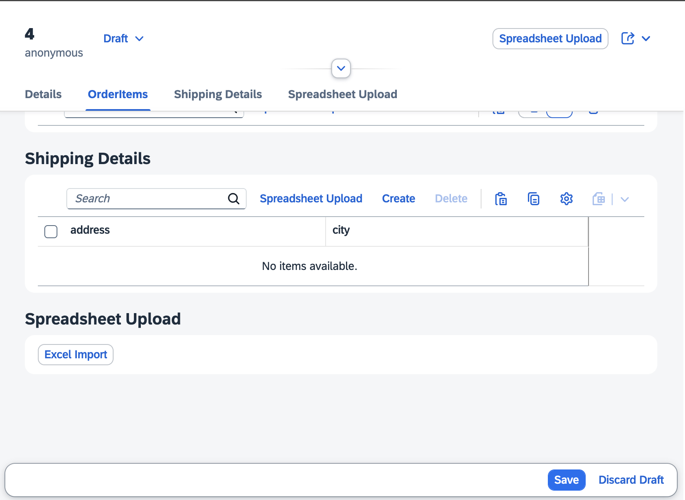

## Button in Component

The usage of the [UIComponent](https://sapui5.hana.ondemand.com/sdk/#/api/sap.ui.core.UIComponent) enables the possibility to return a button with the usage of a [ComponentContainer](https://sapui5.hana.ondemand.com/sdk/#/api/sap.ui.core.ComponentContainer).  
This has the big advantage that no separate dependency has to be installed, and a button for spreadsheet upload can be integrated very easily.

You can also use the button in **Fiori Elements** applications within a section of an object page (see [Including Reuse Components on an Object Page](#including-reuse-components-on-an-object-page)).

### Requirements

- Node.js Version v16.18.0, v18.12.0, or higher  
- npm Version v8.0.0 or higher
- UI5 CLI v3.0.0 or higher

### Getting started

1\. Install from npm

```sh
npm install ui5-cc-spreadsheetimporter
```

2\. Add `resourceRoots` to your `manifest.json` under `sap.ui5`
   
⚠️ You must always keep your `ui5-cc-spreadsheetimporter` and button version up to date here when updating the module.

!!! warning ""
    ⚠️ The `resourceRoots` path "./thirdparty/customcontrol/spreadsheetimporter/v1_7_2" changed from version 0.34.0 to lowercase. Please make sure to use the correct path.


```json
"resourceRoots": {
    "cc.spreadsheetimporter.v1_7_2": "./thirdparty/customcontrol/spreadsheetimporter/v1_7_2"
}
```

3\. Add `components` to your `manifest.json` under `sap.ui5.dependencies`

This is optional and preloads the component on startup of the application.  
   
⚠️ You must always keep your `ui5-cc-spreadsheetimporter` version up to date here when updating the module.

```json
"dependencies": {
  "minUI5Version": "1.108.30",
  "libs": {
    "sap.m": {},
    "sap.ui.core": {},
    "sap.f": {},
    "sap.ui.table": {}
  },
  "components": {
    "cc.spreadsheetimporter.v1_7_2": {}
  }
}
```

4\. Add `componentUsages` to your `manifest.json` under `sap.ui5`
   
⚠️ You must always keep your `ui5-cc-spreadsheetimporter` version up to date here when updating the module.

```json
"componentUsages": {
    "spreadsheetImporter": {
        "name": "cc.spreadsheetimporter.v1_7_2"
    }
}
```

5\. Add the namespace `core` to your XML View

```xml
<mvc:View controllerName="ui.v2.ordersv2freestylenondraft.controller.UploadToTable"
  xmlns="sap.m"
  xmlns:semantic="sap.f.semantic"
  xmlns:mvc="sap.ui.core.mvc"
  xmlns:core="sap.ui.core">
...
</mvc:View>
```

6\. Add the `core:ComponentContainer` control to your view.

```xml
<core:ComponentContainer width="100%" 
usage="spreadsheetImporter" propagateModel="true" 
async="true"/>
```

### Define Configuration Options

You can set configuration options for the spreadsheet importer in the `settings` property of the `core:ComponentContainer` control.  
For special configuration options for the `ComponantContainer`, see [Configuration](Configuration.md#componentcontainerdata).

```xml
<core:ComponentContainer width="100%" 
usage="spreadsheetImporter" propagateModel="true" async="true" 
settings="{
  standalone:true,
  columns: ['product_ID', 'username'],
  componentContainerData:{
    uploadButtonPress:'uploadButtonPress',
    buttonText:'Excel Upload'
    }
  }" />
```

### Example App

#### Freestyle OData V2

XML View: [Detail.view.xml](https://github.com/spreadsheetimporter/ui5-cc-spreadsheetimporter/blob/main/examples/packages/ordersv2freestylenondraft/webapp/view/Detail.view.xml)  
Controller: [Detail.controller.js](https://github.com/spreadsheetimporter/ui5-cc-spreadsheetimporter/blob/main/examples/packages/ordersv2freestylenondraft/webapp/controller/Detail.controller.js)

#### Freestyle OData V2 Standalone

XML View: [UploadToTable.view.xml](https://github.com/spreadsheetimporter/ui5-cc-spreadsheetimporter/blob/main/examples/packages/ordersv2freestylenondraft/webapp/view/UploadToTable.view.xml)  
Controller: [UploadToTable.controller.js](https://github.com/spreadsheetimporter/ui5-cc-spreadsheetimporter/blob/main/examples/packages/ordersv2freestylenondraft/webapp/controller/UploadToTable.controller.js)

## Including Reuse Components on an Object Page

You can also use the button in **Fiori Elements** applications within a section of an object page.  
You can define this in the `manifest.json` under `sap.ui.generic.app` in the `pages` property.

The configuration is documented in the [UI5 documentation](https://sapui5.hana.ondemand.com/sdk/#/topic/d869d7ab3caa48b2a20dc20dfa248380).

A sample configuration can be found in the manifest.json of the [OData V4 Fiori Elements app](https://github.com/spreadsheetimporter/ui5-cc-spreadsheetimporter/blob/main/examples/packages/ordersv4fe/webapp/manifest.json)

```json
"body": {
  "sections": {
    "customSectionReuse": {
      "title": "Spreadsheet Upload",
      "embeddedComponent": {
        "name": "cc.spreadsheetimporter.v1_7_2",
        "settings": {
          "tableId": "ui.v4.ordersv4fe::OrdersObjectPage--fe::table::Items::LineItem-innerTable"
        }
      }
    }
  }
}
```

### Screenshot

